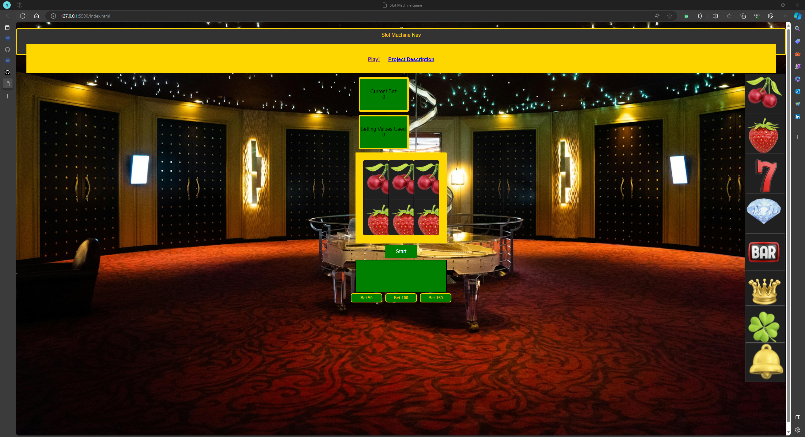
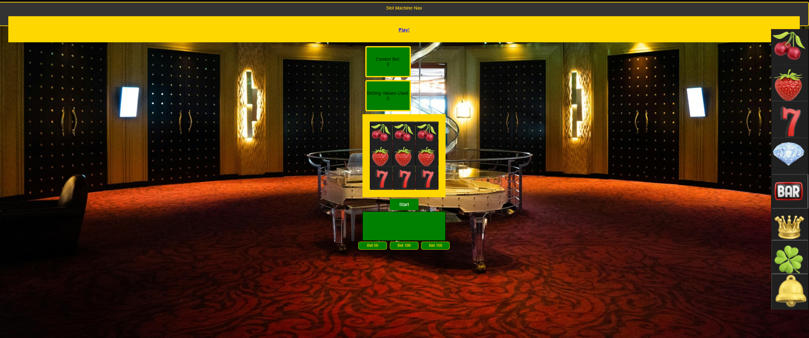
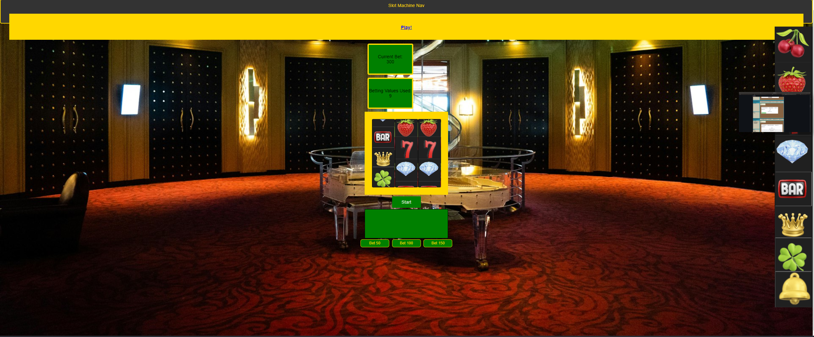

 >An embedded screenshot of the app
 >List of the Technologies used
 >Installation instructions
 >Your User stories – who are your users, what do they want and why?
 >Your Wireframes – sketches of major views / interfaces in your application
 >Descriptions of any Unsolved problems or major hurdles you had to overcome

Game Slot Machine:
Tyler Yim

About the Project

Slot Machine Game

How To:
Researching through Freecodecamp, googling, find solutions through youtube. some details about Slot machines. Thinking about how it would work with 3 slots or 1 slot. Also having a betting feature. I utilized 50 Bet increments, 100 bets, 150 bets and I wanted the for the cost of one roll to be 50. I also developed the containers, div tags to utilize the buttons, the frames of the slots reel1, reel2, reel3. 

Also assigning classes for my current counter, betting counters, slots, start button and reel overlay. 

Images: 
I found online images from unsplash, as well as iphoto trial version. It has slot machine icons. From my research it needs to be a continuous image for the reels to have a matched value. It's matched based on the size of the images. 

So the images would be divided by 
Also with what I researched I found that the a link would need to be use to pull the image. The image is important because the use of the image is focused on initilizing the reels. I have them to the side of the frame so you can see all the items and options. I have createImageelement functions that come up as well as the initlizing the reels. Locally you can pull it from github, but I also found an alternative called imgbb. I used GIMP to edit the layers of each bell, cherry, fruit, diamond on top of each other.

I created the CSS and designed it through creating a casino experience. Not only titling it but allowing the photo background through unsplash. I also wanted to include the current bet amount. 

Unsolved Problems / Major Hurdles
    1. Major hurdles was figuring out the functions of the winning conditions
    2. Getting the slot machine aligned with the image of cropped in with the num_items element
    3. There is some bugs with the lag and then the height and weight of the num_items.
    4. Having the game logic complexity down with possible spinning reels that has the winning combinations, it maybe chonky or chunky.
    5. Being the first app I am coding it is going to be difficult but is going to be an exciting time. 
    6. I want to work through some of the function logic. I did a lot of new research of new functions, such as delta, offset, indexing, createImageElement, Promise
    7. I've set alerts to designate a prompt
    8. The image sometimes doesn't all fit into the slots. 
    9. Does not render well with mobile, but I did include the media element for responsive design. 
    
Timeframes

step 1: Define Game Concepts & Set Up Environment
    -Decide on the theme and visual style of the slot machine
    -setup developer environment
    -create a new project folder
    -setup basic HTML file with a DOM element
    -Create Javasript file for game logic

step 2: Design Game Elements:
-Design Symbols
    -create or find images for the slot machine symbols
    -Gimp to edit & png file upload
    -decide on the payout values for each symbol
        -Outline the basic rules and features (number of reels, symbols)

-Create Reel Layout 
step 3: Implement Game Logic
    Set Up Reels
    1.Write Javascript functions to initilize & spin the reels
    -Display intiial symbols on the canvas
    2. User Button Input:
    Implement for Spinning Reel & Betting Button

step 4: User Experience 
    -Add a user interface for displaying bet amounts & winnings.
    -include buttons for adjusting bet & spinning
    Optimize for Mobile - @media @mediakit
    -ensure the game is responsive and playable on different devices.

step 5: Add Design    
    1. Implement Background and colors 
    Add text elements 
    As well as design for the webpage
    Add Visuals
    -Include html & css
    -enhance visuals with CSS styles or graphics
    
step 6: Implement Win Conditions
    1. Determine Win Lines:
    Define Winning Combinations and Paylines
    2. Calculate Payouts:
    -Write functions to calculate and display winnings
    -Implement Game States (Start, Play, End)
        Create the Game Loop
    - Set Up a game loop to continuously update and render the game 

step 7: Test, Debug, and Deploy
    1. Test the Game
    -Playtest the game to identify and fix bugs
    -Test on Different Browsers and Ensure compatability 
    2. Debug and Refine
    -user Browser developer tools for debugging
    -refine game elements based on feedback
    - manage frame rate and thinking

step 8: Deploy Game
    -Host game local Github
    -share the link with others to gather feedback
    Deploy the Game
    -Host game to local github
    -committing the code
    

step 9: Optimize and Refine:
    -Optimize yoru code for better performance
    -Refine game elements based on playtesting and feedback
    -Check for Responsive Design
    -Documentation to add comments to GA Team
    -Accessibility

--------------------------
Technologies & Resources: I will be using

Technologies Used:
HTML
CSS
JavaScript
GIMP - photo editor
VS Code
Unsplash.com
https://imgbb.com/ - Image URL Hoster
codepen.io

Resources: 
FreecodeCamps - to see examples of others using and building similar games to see what ideas inspire my own

CodeProject: I will utilize to see other inspired as a board for game projects and to see what I can find that are similar to the Game I will be creating.

GitHub: There will be other projects I will be researched to see the logic breakdown for my own research.

Dev: Another forum to see other inspiring projects.

youtube.com: I will watch videos to see how other people constructed similar games and try to create the logic that comes into this breakdown. 

APIS - https://github.com/toddmotto/public-apis

ProgrammableWeb: - API for random number generation and for related to gaming and win or loss outcome.. 
------------------

User Stories

Who: 
    1. Recreational Users: Gamers that want  simple trial and quick gaming experience
    2. Online Gamers: Individuals who enjoy playing on the web and want to test out the UX/ UI or luck.
    3. Recreational Gamblers: Users that are familiar with entertainment of gambling and want to try and seek out if they can outsmart the Game Logic.

What: 
    1. Entertainment / Recreation: Users play the slot machine for a break or roulette sim
    
    2. Chance & Luck - The game has an element of luck and it allows for users to try out their luck or break or outsmart the game logic.

    3. Visual Appeal - Use of the slot and winnings to see how the lines connect

    4. The Gambling Aspect - Understanding the game of slots or the win or loss conditions.

Why:
    1. Fun & Logic - understanding of the slots and what the win or loss conditions are
    2. Nostaglia or Stress Relief  - simple game for positive and negative outcomes that users will use to kill time and reminiscent the game at a different environment.  

Getting Started: 
Installation Instructions:
Clone the Repo
git clone 
npm install

Wireframes

